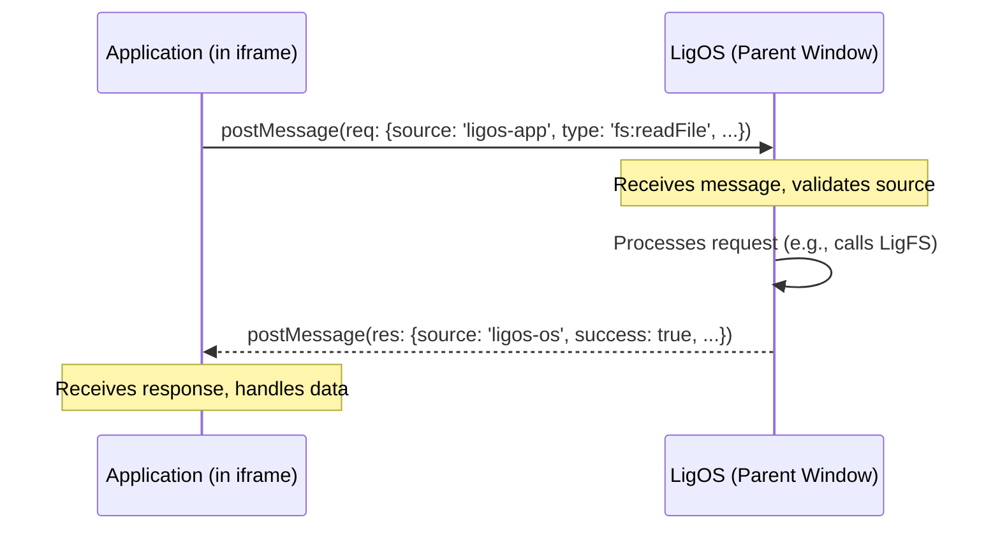

# LigOS 개발자 가이드

이 문서는 LigOS의 아키텍처, 핵심 컴포넌트, 그리고 프로젝트에 기여하는 방법에 대한 심층적인 기술 정보를 제공합니다. LigOS용 애플리케이션을 개발하거나 코어 시스템에 기여하고자 하는 개발자를 위해 작성되었습니다.

---

## 🏛️ 아키텍처 및 핵심 철학 (Architecture & Core Philosophy)

LigOS의 아키텍처는 **느슨한 결합(Loose Coupling)과 샌드박싱(Sandboxing)**이라는 두 가지 핵심 원칙을 기반으로 합니다.

모든 애플리케이션은 OS와 완전히 독립된 웹 페이지로 취급되며, `iframe` 내의 샌드박스 환경에서 실행됩니다. 이 구조는 앱의 오류가 전체 시스템에 영향을 미치는 것을 원천적으로 차단하여 **안정성**을 확보합니다. 또한, 개발자들은 React, Vue, Svelte 등 자신이 선호하는 어떤 웹 기술 스택이든 자유롭게 사용하여 앱을 개발할 수 있어 **자율성**이 극대화됩니다.

### 통신 프로토콜: `window.postMessage`

`iframe`으로 분리된 앱과 OS는 직접적인 함수 호출이 불가능하므로, 모든 상호작용은 표준 `window.postMessage` API를 통해 비동기적으로 이루어집니다.


이 방식은 OS가 허용한 API만을 노출하므로, 예측 가능하고 제어된 환경을 유지할 수 있습니다. 전체 API 명세는 **[API_REFERENCE.md](API_REFERENCE.md)**를 참고하세요.

---

## 🧬 코어 시스템 컴포넌트 (Core System Components)

LigOS는 세 가지 핵심 JavaScript 모듈로 구성됩니다.

### 1. `js/main.js` - OS 커널
OS의 심장부 역할을 하며, 다음과 같은 핵심 기능들을 담당합니다.
- **창 관리**: 창 생성, 드래그, 리사이즈, 최소화/최대화/종료, z-index 관리 등 모든 윈도우 매니저 기능을 수행합니다.
- **메인 UI 렌더링**: 데스크톱, 사이드바, 앱 런처 등의 핵심 UI를 렌더링하고 관리합니다.
- **메시지 브로커**: `window.addEventListener('message', ...)`를 통해 모든 앱으로부터 오는 API 요청을 수신하고, 적절한 컴포넌트(예: `LigFS`, `PackageManager`)에 작업을 위임하는 중앙 허브 역할을 합니다.

### 2. `js/fs.js` - LigFS (가상 파일 시스템)
`localStorage`의 단일 키-값 쌍 내에 전체 파일 시스템을 JSON 트리 형태로 저장하고 관리하는 가상 파일 시스템입니다.
- **데이터 구조**: `{ "type": "directory", "children": { "file.txt": { "type": "file", "content": "..." } } }` 와 같은 재귀적인 객체 구조로 파일과 디렉터리를 표현합니다.
- **API**: `list`, `readFile`, `writeFile`, `createDirectory`, `delete`, `rename` 등 파일 시스템에 필요한 모든 CRUD(생성, 읽기, 업데이트, 삭제) 작업을 위한 메서드를 제공합니다. 모든 변경 사항은 즉시 `localStorage`에 동기화됩니다.

### 3. `js/package_manager.js` - 패키지 매니저
애플리케이션의 설치, 제거 및 메타데이터 관리를 담당합니다.
- **앱 설치**: '설치'는 실제 파일 다운로드가 아닌, 앱의 메타데이터(이름, URL, 아이콘 경로)를 `localStorage`에 저장하는 과정입니다.
- **앱 관리**: 설치된 앱 목록과 사이드바에 고정된 앱 목록을 관리하며, `getPrograms`, `getPinnedApps`, `pinApp`, `uninstallApp` 등의 메서드를 통해 앱 데이터를 관리합니다.

---

## 🚀 새 애플리케이션 개발하기

LigOS용 앱을 만드는 과정은 간단한 웹 페이지를 만드는 것과 유사합니다.

**1단계: 기본 파일 구조 생성**
프로젝트 내의 `programs` 디렉터리 안에 새 폴더를 만들고, `index.html`, `app.js`, `app.css`, `icon.svg` 파일을 생성합니다.

**2단계: OS와 통신 설정 (`app.js`)**
앱과 OS 간의 통신을 쉽게 처리하기 위해 `postMessage`를 `Promise`로 감싸는 래퍼 함수를 만드는 것이 좋습니다.

```javascript
// app.js

// Promise 기반의 API 요청 헬퍼
function osRequest(type, payload) {
    // ... TUTORIAL.md 또는 다른 앱의 소스를 참고하여 구현 ...
}

document.addEventListener('DOMContentLoaded', () => {
    // 여기에 앱 로직을 작성합니다.
    const fileContentDiv = document.getElementById('file-content');
    
    // 예시: /home/user.txt 파일 읽기
    osRequest('fs:readFile', { path: '/home/user.txt' })
        .then(content => {
            fileContentDiv.textContent = content;
        })
        .catch(error => {
            fileContentDiv.textContent = `Error: ${error.message}`;
        });
});
```

**3단계: 앱 설치 및 테스트**
LigOS를 실행하고 터미널을 열어 아래 명령어를 입력하여 앱을 설치합니다.
```bash
# 형식: lig install <앱 이름> <앱 URL> <아이콘 URL>
lig install "My App" "programs/my-app/index.html" "programs/my-app/icon.svg"
```
설치가 완료되면 '모든 프로그램' 런처에 "My App"이 나타나며, 클릭하여 실행하고 테스트할 수 있습니다.

---

## 🤝 기여 방법 (Contributing)

LigOS는 오픈소스 프로젝트이며, 여러분의 기여를 언제나 환영합니다.

1.  **이슈 트래커**: GitHub Issues를 통해 버그를 보고하거나 새로운 기능을 제안해주세요.
2.  **코드 기여**:
    -   이 저장소를 Fork한 후, 새로운 기능 브랜치를 생성합니다 (`git checkout -b feature/MyNewFeature`).
    -   변경사항을 커밋하고 브랜치에 푸시합니다.
    -   Pull Request를 생성하여 변경 내용을 설명해주세요.

## 🗺️ 향후 로드맵 (Future Roadmap)

-   [ ] 드래그 앤 드롭 파일 업로드 기능
-   [ ] 이미지 뷰어, 계산기 등 더 다양한 기본 앱 추가
-   [ ] 창과 UI 요소에 대한 테마 시스템 확장
-   [ ] 사용자 계정 및 원격 스토리지 연동 (장기 목표)
-   [ ] WebRTC를 이용한 앱 간 통신 채널 구현

## 📁 프로젝트 구조 (Project Structure)
```
/
├── assets/               # OS 공용 자원 (로고 등)
├── css/
│   └── style.css         # 메인 데스크톱 UI 스타일
├── js/
│   ├── fs.js             # 가상 파일 시스템 (LigFS) 로직
│   ├── main.js           # OS 핵심 로직 (커널)
│   └── package_manager.js# 앱 설치 및 관리
├── programs/             # 모든 내장/설치된 앱
│   ├── terminal/         # 터미널 앱
│   ├── settings/         # 설정 앱
│   └── file-manager/     # 파일 관리자 앱
├── index.html            # OS의 진입점 (데스크톱)
├── README.md             # 프로젝트 개요 및 소개
├── DEVELOPER_GUIDE.md    # 개발자용 심층 가이드
└── API_REFERENCE.md      # 앱 개발 API 명세
``` 